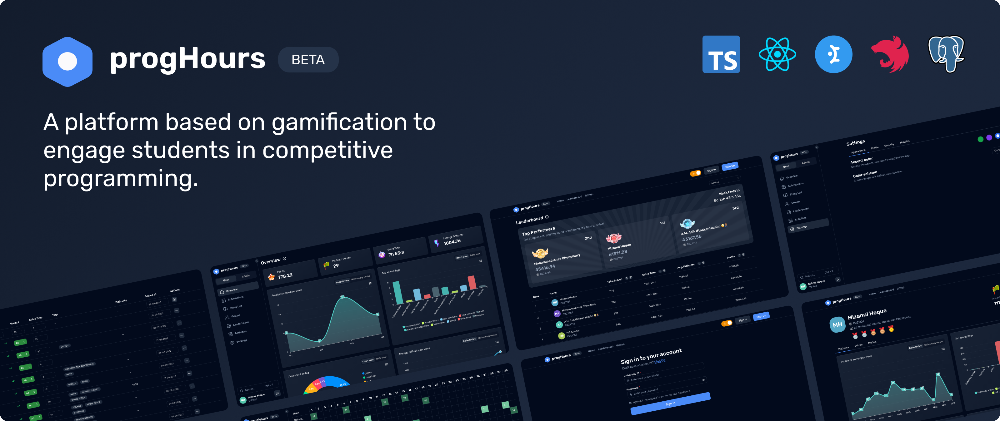

# progHours

**_A platform based on gamification to engage students in competitve programming_**


Motivating students to learn and practice problem solving is a challenge. However, with the right approach and tools, it is possible to engage and motivate students to learn and improve their skills in this area.

Gamification can be a useful tool to make learning and practicing problem solving more engaging and enjoyable.

This project is an effort to combine problem-solving and gamification techniques to make a platform that will motivate users to keep improving their skills and compete with others.

## Goals

This project is experimental and we are working to define and refine our goals. However, we have settled on the following common goals for the project:

- To provide a fun and engaging platform for students.
- To use gamification techniques, such as leaderboard, points and rewards, to motivate students to learn and compete with others.
- To foster a sense of community and shared accomplishment among students by providing a platform for them to compete with one another and track their progress.
- To provide students with the opportunity to showcase their profile and skillls to tech recruiters.

## Features

- [x] Submissions tracking system
  - [x] Supports 14 online judges
  - [x] vjudge private contests
  - [x] Automated tracking from Online Judges
- [x] User profile and statistics
- [x] Study list
- [x] User activities
- [x] Leaderboard
- [x] Groups
  - [x] Group leaderboard
  - [x] Problem lists integrations
- [x] Problem lists
- [ ] Reward system
  - [x] Medals based on solve count
  - [ ] Medals based on categories
- [ ] Contest platform [Planned]
  - [ ] Integrate with [go-sandbox](https://github.com/criyle/go-sandbox)
  - [ ] Host contests with custom problemset.
- [x] Role Based Access Control (RBAC)
- [x] Admin panel
  - [x] User management
  - [x] Group management
  - [x] Problem management
  - [x] Crawler health test

## Online Judge Support

We have support for 14 Online Judges, you can add any problem from these Online Judges. To make it happen, we've built a separate library called `oj-problem-parser` [Read More](https://github.com/naimulcsx/progHours/tree/development/libs/oj-problem-parser)

## Tech Stack

- _Frontend:_ React, Mantine, TanStack Query, TanStack Table
- _Backend:_ NestJS, PostgreSQL, Prisma

## Local development

### Prerequisites

- NodeJS
- Docker

### Steps

#### Step 1: Clone the Repository

Begin by cloning this repository to your machine.

```
git clone git@github.com:naimulcsx/progHours.git
```

#### Step 2: Install the dependencies

Install the dependencies.

```bash
yarn install
```

#### Step 3: Run necessary components

Navigate to the `progHours` directory and run the components using docker-compose.

```bash
cd progHours
docker-compose -f docker-compose.yml up -d
```

#### Step 4: Run database migrations

If you are setting up for the first time, you need to run database migrations

```bash
npm run db:migrate
```

#### Step 5: Launch the project

Launch the project by running the following command.

```bash
npm run dev
```

_Note: The project is currently undergoing a massive refactoring process. As a result, the contents of the current branch may not include all the features or functionalities you might be expecting._
