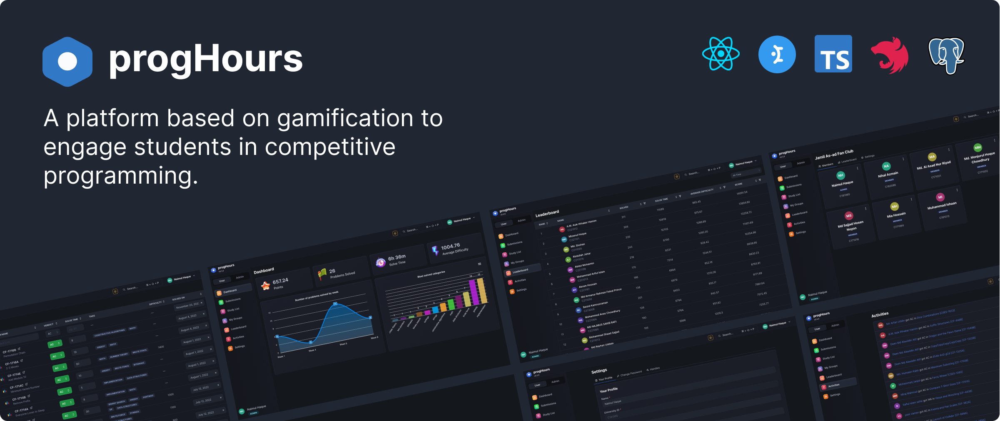

# progHours

Competitive programmers are always on the lookout for ways to improve their skills. For a participant, sometimes it gets difficult to stay motivated at times. This is where our application comes into play. We've tried to gamify the whole experience of Competitive Programming. We have a few primary goals in mind.

- Provide a competitive environment for competitive programmers to keep going without slowing down.
- Help competitive programmers in keeping track of what they are doing throughout their journey.
- Assist coaches in identifying the progress of his students.

## Features

- [x] Personal tracking system
  - [x] Supports over 15 online judges
  - [x] Supports vjudge private contests
  - [ ] Automated tracking from online judges
- [x] User profile and statistics
- [ ] Role Based Access Control (RBAC)
  - [x] User Management
  - [ ] Problem Management
- [ ] Problem Lists
- [x] User Groups
  - [ ] Problem Lists integration for Groups
- [ ] Gamified Elements
  - [x] Medals based on solve count
- [ ] Contest Platform
  - [ ] Host contests with custom problemset.

## Online Judge Support

Right now we have support for 17 Online Judges, but some of them might have a few limitations. You can only add problems that is supported by our systems right now. The work is in progress and we are working hard to make it more flexible and easy.

- **Codeforces**
  - `https://codeforces.com/gym/{gymId}/problem/{problemId}`
  - `https://codeforces.com/problemset/problem/{contestId}/{problemId}`
  - `https://codeforces.com/contest/{contestId}/problem/{problemId}`
- **CodeChef**
  - `https://www.codechef.com/submit/{problemId}`
  - `https://www.codechef.com/problems/{problemId}`
  - `https://www.codechef.com/{contestId}/problems/{problemId}`
- **CSES**
  - `https://cses.fi/problemset/task/{problemId}`
- **UVA**
  - `https://onlinejudge.org/index.php?option=com_onlinejudge&Itemid=8&page=show_problem&problem={problemId}`
- **Toph**
  - `https://toph.co/p/${problemId}`
- **SPOJ**
  - `https://www.spoj.com/problems/${problemId}`
- **Hackerrank**
  - `https://www.hackerrank.com/challenges/{problemId}`
  - `https://www.hackerrank.com/contests/{contestId}/challenges/{problemId}`
- **LightOJ**
  - `https://lightoj.com/problem/{problemId}`
- **AtCoder**
  - `https://atcoder.jp/contests/{contestId}/tasks/{problemId}`
- **EOlymp**
  - `https://www.eolymp.com/en/problems/{problemId}`
- **Leetcode**
  - `https://leetcode.com/problems/${problemId}`
- **Timus**
  - `https://acm.timus.ru/problem.aspx?space=1&num={problemId}`
- **CodeToWin**
  - `https://codeto.win/problem/{problemId}`
- **Kattis**
  - `https://open.kattis.com/problems/${problemId}`
- **Vjudge**
  - Supports `Codeforces`, `Codechef`, `AtCoder`, `LightOJ`, `SPOJ`, `Toph`, `EOlymp` from both problem pages or private contests (need password).

## Tech Stack

- _Frontend:_ React, Chakra UI, React Query
- _Backend:_ TypeScript, NestJS, Prisma
- _Database:_ PostgreSQL

## Installation

### Prerequisites

- To run this project, you must have `Docker` installed

### Steps

#### Step 1: Clone the Repository

Begin by cloning this repository to your machine, and running it through `Docker Compose`

#### Step 2: Setup environment variables

```
POSTGRES_USER=
POSTGRES_PASS=
POSTGRES_PORT=
POSTGRES_DB=
ACCESS_TOKEN_SECRET=
VJUDGE_USERNAME=
VJUDGE_PASSWORD=
ADMINER_PORT=
```

#### Step 3: Run it through `docker-compose`

```bash
cd progHours
docker-compose -f docker-compose.dev.yml up -d
```

Note: Please use the `docker-compose.prod.yml` when you are deploying the project.

#### Step 4: Run database migrations (only first time)

```bash
docker exec -it api_server sh
npx prisma migrate dev
npx prisma db seed
```

Note: If you are deploying, use `npx prisma migrate deploy` instead of `npx prisma migrate dev`.
